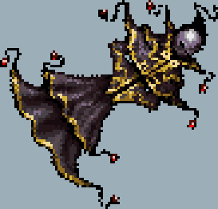
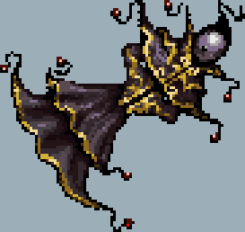
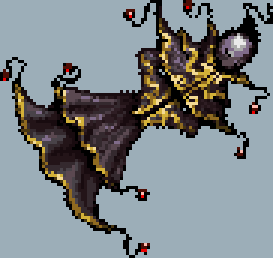

# pixel-game-lib

[](https://github.com/tversteeg/pixel-game-lib/actions?workflow=CI)
[](https://crates.io/crates/pixel-game-lib)
[](https://docs.rs/pixel-game-lib)
[](#license)
[](#downloads)

### [Documentation](https://docs.rs/pixel-game-lib/)

<!-- cargo-rdme start -->

AGPL licensed and opinionated game engine for 2D pixel-art games.

#### Features

- Pixel-perfect pixel art rendering with built-in rotsprite rotation shader.
- Window creation with independent update and render game loop.
- Hot-reloadable assets, seeing your assets update live in the game when you save them is a great boost in productivity for quickly iterating on ideas.
- Single-binary, all assets should be embedded in the binary when deploying.
- Simple bitmap font drawing.
- Dialogue scripting system.
- Audio playback.
- In game CPU & memory profiler GUI.

#### Goals

- Ergonomic API, with a focus on quickly creating small games, especially for game jams.
- Reasonable performance, drawing thousands of animated sprites at the same time shouldn't be a problem.
- Proper web support, it should be very easy to bundle as WASM for the web.

#### Non-Goals

- An ECS (Entity component system), although an ECS architecture is great for cache locality and performance, I feel that it's overkill for most small games. Nothing is stopping you to add your own on top of this engine if that's what you want though!
- 3D, this engine is only for 2D pixel art.
- Vector graphics, similar to the above, this engine is focused specifically on pixel art with lower resolutions.
- Reinventing the wheel for everything, when there's a proper crate with good support I prefer to use that instead of creating additional maintainer burden.

#### Usage

Using this crate is quite simple, there is a single trait [`PixelGame`] with a single required function, [`PixelGame::tick`] that needs to be implemented for a state.

```rust
use pixel_game_lib::{PixelGame, Context, GameConfig};

struct MyGame;

impl PixelGame for MyGame {
  fn tick(&mut self, ctx: Context) {
    // ..
  }
}

// In main
let game = MyGame;

game.run(GameConfig::default())?;
```

#### Feature Flags

All major feature flags are enabled by default, I would recommend installing `pixel_game_lib` with `default-features = false` and adding the required features as needed.

```sh
cargo add pixel_game_lib --no-default-features
```

##### `hot-reloading-assets` (default)

Hot-reload assets from disk when they are saved.
Has no effect on the web target.

##### `embedded-assets` (default on web)

Bake _all_ assets in the `assets/` folder in the binary.
When creating a release binary this feature flag should be enabled.

##### `dialogue` (default)

A thin wrapper around [Yarn Spinner](https://www.yarnspinner.dev/).
Allows creating hot-reloadable dialogue systems.

##### `audio` (default)

A thin wrapper around [Kira](https://docs.rs/kira/latest/kira/).
Play sounds and music files which can be hot-reloadable using assets.

To keep the binary and compile-times small only `.ogg` audio files are supported.

###### Requirements

On Linux you need to install `asound2-dev`:

```sh
sudo apt install libasound2-dev
```

##### `in-game-profiler` (default)

A profiler window overlay, implemented with [puffin_egui](https://docs.rs/puffin_egui/latest/puffin_egui/).

Other profiling methods in your game can also be implemented, the [profiling](https://docs.rs/profiling/latest/profiling/) crate is enabled even when this feature flag is disabled.

#### Example

This example will show a window with a counter that's incremented when pressing the left mouse button[^left-mouse].
The counter is rendered as text[^text] loaded from a font in the top-left corner.
When the 'Escape' key is pressed[^escape-key] the game will exit and the window will close.

```rust
use pixel_game_lib::{PixelGame, Context, GameConfig, MouseButton, KeyCode, glamour::Vector2};

/// Object holding all game state.
struct MyGame {
  /// A simple counter we increment by clicking on the screen.
  counter: u32,
}

impl PixelGame for MyGame {
  fn tick(&mut self, ctx: Context) {
    // ^1
    // Increment the counter when we press the left mouse button
    if ctx.mouse_pressed(MouseButton::Left) {
      self.counter += 1;
    }

    // ^2
    // Display the counter with a font called 'font' automatically loaded from the `assets/` directory
    // It will be shown in the top-left corner
    ctx.text("font", &format!("Counter: {}", self.counter)).draw();

    // ^3
    // Exit the game if 'Escape' is pressed
    if ctx.key_pressed(KeyCode::Escape) {
      ctx.exit();
    }
  }
}

// In main

// Initialize the game state
let game = MyGame { counter: 0 };

// Run the game until exit is requested
game.run(GameConfig::default().with_title("My Game"))?;
```

[^left-mouse]: [`crate::Context::mouse_pressed`]
[^text]: [`crate::Context::text`]
[^escape-key]: [`crate::Context::key_pressed`]

<!-- cargo-rdme end -->

#### Rotation Algorithms

In the library it's possible to choose between multiple upscale implementations for the single-pass RotSprite algorithm, see the Rust documentation for more information:

##### Nearest Neighbor

This doesn't apply any extra rotation effects.



##### Scale3x



##### Diag2x



##### Scale2x


#### Credits

- [gtoknu](https://www.shadertoy.com/view/4l2SRz) for the branchless scale2x shader.
- [@damieng](https://damieng.com/typography/zx-origins/beachball/) for the font behind the `default-font` feature.
- [KenneyNL](https://kenney.nl/assets/ui-audio) for the audio sample in the example.
